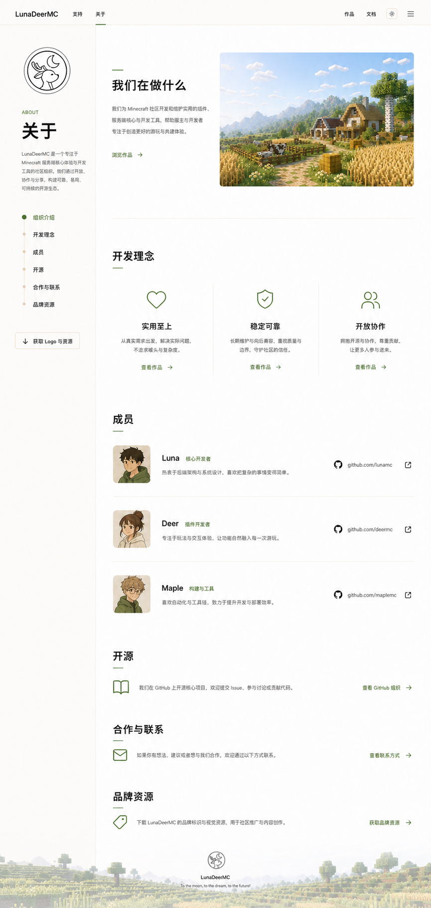

# 关于页面

> 本文档固化 `/about` 的已确认信息架构、视觉结构与空间节奏。关于页是一份可浏览的品牌手册，不是把所有组织信息压缩进首屏的团队名片。

- 最后更新：2026-07-30
- 状态：核心结构、浅色视觉与长滚动节奏已确认；正式成员资料、深色适配和精确响应式尺寸待实现阶段校准

## 权威视觉参考



该图是桌面端整体构图、章节顺序和内容密度的权威参考。成员头像、姓名、简介及链接属于视觉稿示例，正式内容必须来自站点配置。

## 页面职责

关于页需要让访问者依次理解：

1. LunaDeerMC 是什么、正在做什么。
2. 团队以什么原则设计和维护作品。
3. 谁在参与，以及每位成员的职责。
4. 如何参与开源、建立合作或获取品牌资源。

页面以叙事顺序降低认知负担，不把组织介绍、价值观、成员和联系入口并列成等权信息块。

## 已确认架构

桌面端采用“手册式左侧索引 + 右侧长内容列”：

- 左侧保留官方 Logo、`ABOUT`、页面标题、简短介绍和页内锚点。
- 右侧依次展示 `组织介绍`、`开发理念`、`成员`、`开源`、`合作与联系`、`品牌资源`。
- 左侧索引可以随阅读保持可见，并同步标识当前章节。
- 右侧内容列遵守舒适行长，不因宽屏无限拉伸；图像可以比正文更宽，但仍与网格建立明确关系。

窄屏不保留永久双栏。页内索引应转为紧凑目录入口，正文继续保持原有章节顺序。

## 开场与组织介绍

- 开场由“我们在做什么”、短说明、一个主要跳转和白天牧场局部图像组成。
- 图像用于建立品牌环境，不承担首页式沉浸场景职责，不能压过页面叙事。
- 浅色模式使用白天牧场；深色模式使用黄昏红石工坊的局部环境图。
- 官方 Logo 必须使用 [`lunadeermc-brand-logo.png`](./assets/lunadeermc-brand-logo.png)，不重绘、不添加方块底座或额外装饰。

## 开发理念

采用开放三列结构：

```text
实用至上    稳定可靠    开放协作
```

- 每列包含 Lucide 语义图标、原则名称和一句解释。
- 三列位于同一开放表面，以对齐、留白和细分隔线建立关系。
- 不渲染为独立悬浮卡片，不使用 Minecraft 方块或像素风功能图标。
- 列内可以设置与作品或文档相关的文本操作，但操作不能抢过原则说明。

## 成员

成员采用具有信息深度的横向列表行：

```text
头像 | 姓名与角色 | 简短介绍 | GitHub 身份 | 外链图标
```

- 每行只对应一位成员，以细分隔线连接成完整列表。
- 头像比例、姓名基线和角色标签保持统一。
- 简介优先说明职责与关注方向，避免堆叠社交标签。
- GitHub 等外部身份使用成熟品牌或 Lucide 图标；链接需有可见焦点与外链反馈。
- 成员数量增加时继续纵向扩展，不通过缩小头像、正文或行距强行塞入首屏。

## 后续章节

`开源`、`合作与联系`、`品牌资源` 是三个独立章节：

- `开源` 解释公开协作方式并进入 GitHub 组织或贡献指南。
- `合作与联系` 提供适用场景和明确联系方式。
- `品牌资源` 提供 Logo、使用说明和可下载资产。

三个章节可以使用精简的图标、说明和文本操作，但不能被合并成紧贴成员列表的三行页脚菜单。

## 纵向节奏

- 页面按长滚动品牌内容设计，不追求在单个桌面视口中展示全部章节。
- 开场与 `开发理念` 之间、`开发理念` 与 `成员` 之间，以约 `128–160px` 的桌面端间隔作为视觉校准范围。
- `成员` 与后续三个主要章节之间，以及后续章节彼此之间，以约 `120–160px` 为校准范围。
- 区段内部使用较小间距组织标题、说明、媒体和列表；主要区段间距必须明显大于组件内部间距。
- 移动端主要区段间距收敛至约 `56–80px`，但仍保留章节停顿。
- 空白是信息结构的一部分，不能通过无意义装饰或更多卡片填满。

## 视觉系统

- 浅色继承白天牧场的燕麦画布、牧草绿强调、暖纸色表面和浅棕分隔线。
- 深色继承黄昏红石工坊的暖炭褐画布、红石珊瑚强调和对应环境图。
- 采用“开放几何”：通过稳定对齐、排版层级、留白和细分隔线组织内容。
- 界面图标统一来自 Lucide 或必要的官方品牌图标，不使用体素、像素画、Emoji 或手绘占位图标。
