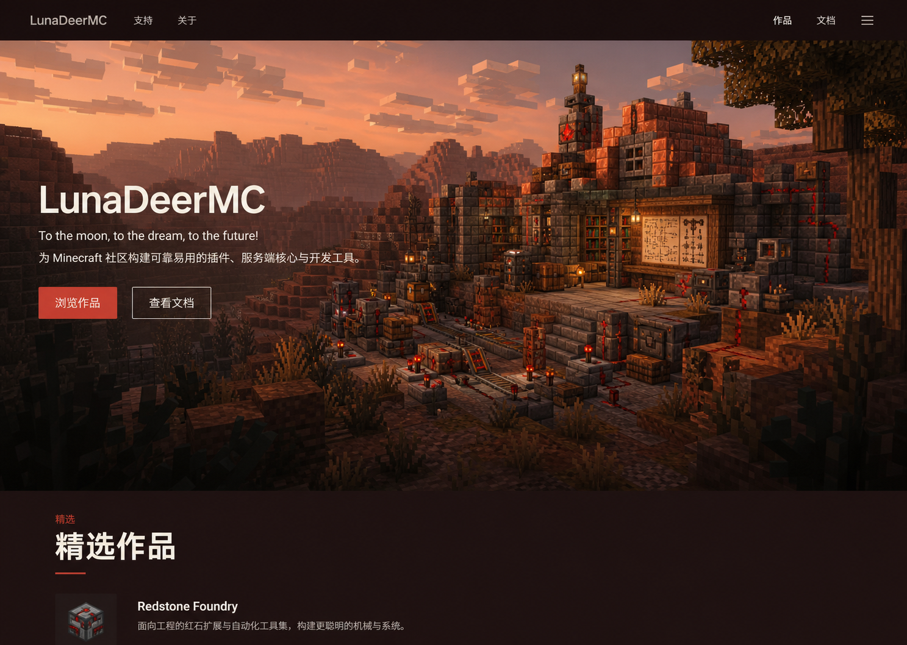
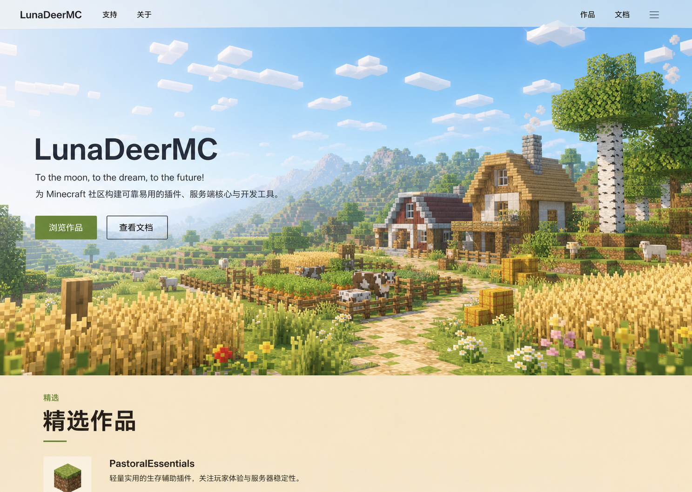

# 全站颜色系统

> 本文档定义 LunaDeerMC 的双主题视觉方向与语义配色基线。两套主题及 v1 色板已经通过主页交互原型确认；正式场景资产必须向这组界面颜色收敛。

- 最后更新：2026-07-30
- 状态：双主题方向与语义色板 v1 已确认

## 总体结论

LunaDeerMC 使用两套彼此呼应、但场景内容完全独立的主题：

```text
深色模式：黄昏红石工坊 / Redstone Dusk
浅色模式：白天牧场 / Sunlit Pastoral
```

它们不是同一幅图的暗色版和亮色版。主题切换会同时改变：

- 首页四层 Minecraft 场景资产。
- 场景前景与精选作品舞台颜色。
- 导航、页面表面、正文、边框和交互颜色。
- 光照氛围、环境辅助色与作品媒体的光学校准。

两套主题共享品牌身份、排版、布局、交互结构和语义色职责。

## 深色模式：黄昏红石工坊

视觉参考：



### 场景气质

- 时间：太阳刚落下或接近落日后的暖色黄昏。
- 主题：建在连续山地中的红石工程工坊和开发者聚落。
- 感受：创造、可靠、专注、有技术气息，但不像服务器商城或科幻控制台。
- 材质：深色石材、红铜、陶瓦、木材、红石线路和少量暖灯。

### 颜色职责

```text
基础画布       深暖炭褐或深酒红褐
抬升表面       比画布略亮的暖灰褐
主要文字       暖月白
次要文字       低饱和暖灰
主要操作       红石珊瑚
场景辅助色     陶瓦、红铜、琥珀灯光
冷色平衡       少量石灰蓝或氧化铜绿
```

深色模式不以旧原型中的蓝黑和紫蓝暮光为主。红石珊瑚只承担关键操作和场景焦点，不能扩散为满屏红光。

## 浅色模式：白天牧场

视觉参考：



### 场景气质

- 时间：太阳已经升高的晴朗白天，不是清晨、黄昏或提亮后的夜景。
- 主题：开阔牧场、麦田、农舍、谷仓、草坡和远山。
- 感受：清新、开放、安定、友好，保留 Minecraft 探索感而不儿童化。
- 材质：麦田、草地、浅石、蜂蜜色木材、围栏和少量乡野花色。

### 颜色职责

```text
基础画布       浅燕麦或暖石灰色
抬升表面       柔和暖白
主要文字       深森林炭灰
次要文字       中性苔灰
主要操作       牧草绿
场景辅助色     天空蓝、麦穗金、自然叶绿
品牌呼应       少量谷仓红或珊瑚色
```

浅色模式不是纯白页面，也不是把黄昏红石工坊提高曝光。它拥有独立的白天牧场场景和以燕麦、麦田、草地为来源的界面色。

## 首页同色关系

两个主题分别建立自己的精确同色关系：

```text
scene.foreground.dark  = surface.featured.dark
scene.foreground.light = surface.featured.light
```

- 深色模式由黄昏场景的深暖前景延续为深色精选作品舞台。
- 浅色模式由牧场场景底部的麦田／燕麦色基底延续为浅色精选作品舞台。
- 两个等式各自要求像素级一致，不要求深浅主题使用同一个色值。
- 正式场景资产必须在底部可连续区域向已确认令牌收敛，不能通过整图滤镜强行制造匹配；若色彩管理造成细微偏差，场景前景与精选作品令牌必须成对校准。

## 共享语义令牌

界面组件只使用语义职责，不直接绑定“黄昏色”或“牧场色”：

```text
surface.canvas
surface.subtle
surface.raised
surface.featured
text.primary
text.secondary
text.muted
border.default
accent.primary
accent.hover
accent.on-primary
focus.ring
scene.foreground
```

浅色和深色分别为同一组令牌提供取值。主题切换不能改变内容顺序、组件尺寸或交互含义。

## 语义色板 v1（已确认）

以下色值来自两张已选视觉参考的定点取样，并在主页双主题交互原型中完成了页面级视觉确认。它们是后续页面设计与正式实现的统一基线；若因可访问性或色彩管理问题需要调整，必须记录原因并同步检查两个主题。

| 语义职责 | 黄昏红石工坊（深色） | 白天牧场（浅色） |
| --- | --- | --- |
| `surface.canvas` | `#1B100F` | `#FFF9ED` |
| `surface.featured` | `#1F1211` | `#F6E5C7` |
| `scene.foreground` | `#1F1211` | `#F6E5C7` |
| `surface.subtle` | `#2A1A18` | `#FBEED8` |
| `surface.raised` | `#38231F` | `#FFFFFF` |
| `text.primary` | `#FFF7ED` | `#251D19` |
| `text.secondary` | `#D8C9BF` | `#51463C` |
| `text.muted` | `#A89387` | `#716554` |
| `border.default` | `#5A4039` | `#C8B999` |
| `border.strong` | `#8B655C` | `#927F63` |
| `accent.primary` | `#C73E2F` | `#51752D` |
| `accent.hover` | `#B8362A` | `#436325` |
| `accent.on-primary` | `#FFFFFF` | `#FFFFFF` |
| `accent.link` | `#F06C55` | `#3F651F` |
| `focus.ring` | `#F19A62` | `#355E7D` |

### 取值说明

- 深色参考图的精选作品空白区域中心值接近 `#1F1211`，因此将它同时作为 `surface.featured.dark` 和 `scene.foreground.dark` 的第一版锚点。
- 浅色参考图的精选作品空白区域中心值接近 `#F6E5C7`，因此将它同时作为 `surface.featured.light` 和 `scene.foreground.light` 的第一版锚点。
- `surface.canvas` 与 `surface.featured` 不必相同：前者服务普通页面，后者承担首页场景衔接。
- 浅色的 `surface.raised` 可以使用白色，但不能把整页画布改成纯白；白色只用于少量需要抬升的表面。
- 默认边框只用于低强调分隔；键盘焦点、选中边界和需要独立识别的控件使用 `border.strong` 或 `focus.ring`。
- 深色主题的链接使用比按钮更亮的珊瑚色，避免红石按钮色直接作为小字号正文链接时对比不足。
- 浅色主题使用较深的牧草绿作为操作色，避免参考图中的亮绿色按钮搭配白字时对比不足。

## 场景辅助色 v1

场景辅助色用于插画、封面和少量品牌装饰，不直接替代界面语义令牌：

| 场景角色 | 黄昏红石工坊 | 白天牧场 |
| --- | --- | --- |
| 天空／环境 | `#D88765` 暖霞陶粉 | `#9DD0F4` 晴空蓝 |
| 自然／冷平衡 | `#6F7868` 氧化灰绿 | `#668E38` 牧草绿 |
| 地形／作物 | `#7A4634` 深陶土 | `#D8B45A` 麦穗金 |
| 建筑／材质 | `#A65436` 红铜陶瓦 | `#B68A4D` 蜂蜜木 |
| 局部品牌呼应 | `#E24732` 红石亮点 | `#A8513B` 谷仓红 |

场景辅助色允许因光照自然变化，不要求每个像素等于表中数值；界面语义令牌则必须保持稳定。

## 语义状态色

信息、成功、警告和错误颜色必须在两套主题中独立校准，并同时使用图标或文字，不能只依赖颜色表达状态。

品牌强调色不替代语义色：

- 红石珊瑚不自动等于错误。
- 牧草绿不自动等于成功。
- 麦穗金不自动等于警告。
- 天空蓝不自动等于信息。

## 对比度与光学校准

- 正文、导航、按钮、焦点、边框和代码内容分别满足可访问对比度。
- 大面积浅色画布避免刺眼纯白；深色画布避免纯黑和高反差白字。
- 场景上方的 Hero 文案必须针对两套图片分别确认安全区和局部对比度。
- 不允许依赖覆盖整幅场景的深色蒙层来补救不可读的构图。
- 作品封面可保留自身颜色，但周围文字和表面必须适配当前主题。

### v1 关键对比度

| 组合 | 对比度 |
| --- | ---: |
| 深色 `text.primary` / `surface.featured` | `17.16:1` |
| 深色 `text.secondary` / `surface.featured` | `11.30:1` |
| 深色 `text.muted` / `surface.featured` | `6.24:1` |
| 深色 `accent.link` / `surface.featured` | `6.06:1` |
| 深色白字 / `accent.primary` | `5.05:1` |
| 浅色 `text.primary` / `surface.featured` | `13.36:1` |
| 浅色 `text.secondary` / `surface.featured` | `7.40:1` |
| 浅色 `text.muted` / `surface.featured` | `4.59:1` |
| 浅色 `accent.link` / `surface.featured` | `5.48:1` |
| 浅色白字 / `accent.primary` | `5.34:1` |

`text.muted.light` 已接近普通文字 AA 下限，不应再降低透明度。`border.default` 是装饰性分隔，不能单独承担焦点、选中或输入边界。

## 防偏离约束

- 不恢复水面、倒影或旧版蓝紫「暮月」作为全站唯一主题。
- 不把白天牧场做成黄昏红石工坊的曝光或色温滤镜。
- 不把黄昏工坊做成青紫霓虹、控制台 HUD 或服务器商城。
- 不把白天牧场做成儿童农场游戏、卡通贴纸界面或纯白 SaaS 模板。
- 不使用满屏发光描边、玻璃拟态或渐变文字作为品牌捷径。
- 首页精选作品背景在每个主题下都必须与相应近景主体色完全一致。

## 尚待确定

- 支持、关于、作品列表和文档代表页面对这套已确认色板的具体运用比例。
- 正式场景资产完成后的色彩管理检查；资产下沿应向已确认的 `scene.foreground` 收敛。若仍出现可辨色缝，只能将 `scene.foreground` 与 `surface.featured` 成对微调并重新确认。
- 弹层、遮罩、禁用状态和反色媒体表面的透明度。
- 代码语法高亮的浅色和深色配色。
- 图表与数据可视化扩展色板。
