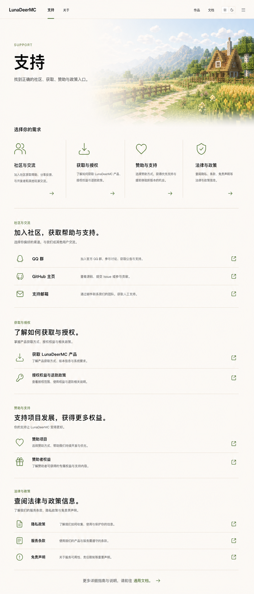

# 支持中心页面

> 本文档固化 `/support` 的已确认视觉结构。支持中心是单页导向页，不替代通用文档中的详细说明与政策正文。

- 最后更新：2026-07-30
- 状态：核心结构、浅色视觉与长滚动节奏已确认；深色适配和精确响应式尺寸待正式实现校准

## 权威视觉参考



该图是支持中心桌面端核心构图和纵向节奏的权威参考。图中的具体渠道名称和说明属于视觉稿示例，正式内容由站点配置与双语文案提供。

早期紧凑构图保留在 [`support-page-approved.png`](./assets/support-page-approved.png) 中，仅用于记录方案演进，不再作为密度或首屏高度的实现依据。

## 页面职责

支持中心帮助用户先判断需求类型，再进入正确渠道：

```text
社区与交流
获取与授权
赞助与支持
法律与政策
```

页面不建立工单系统、站内联系表单或长篇常见问题，也不重复承载通用文档中的完整规则。

## 已确认结构

桌面页面分为三个层次：

1. 支持中心身份区：`SUPPORT`、页面标题和一句目的说明。
2. 四条路径导览：四个并列的页内锚点，分别说明适合处理的需求。
3. 四个独立区段：依次以开放列表展示社区、获取、赞助和政策的具体入口。

页面按长滚动内容组织，不要求把路径导览和某个完整明细区段同时塞入首屏。首屏可以使用白天牧场的局部环境图作为轻量品牌氛围，但内容导览必须保持主导地位。深色模式对应使用黄昏红石工坊的局部环境图。

## 四条路径

- `#community`：社区与交流。
- `#obtain`：获取与授权。
- `#sponsor`：赞助与支持。
- `#legal`：法律与政策。

每条路径由 Lucide 语义图标、标题、短说明和方向箭头组成。四条路径共享同一开放表面，以列线和留白分隔，不渲染成四张悬浮卡片。

## 区段明细

- 渠道条目采用平面列表：图标、名称、用途说明、外链或站内跳转图标。
- `社区与交流`、`获取与授权`、`赞助与支持`、`法律与政策` 各自形成完整章节，不合并成一张总览卡片。
- 每个渠道必须说明适用事项，避免用户把公开问题、私人联系、购买问题或法律请求发送到错误入口。
- 外部渠道使用统一外链反馈；政策和完整规则进入“文档 → 通用”。
- 页面滚动到某个区段时，可以同步突出对应路径，但不能依赖动态效果才能理解当前位置。

## 纵向节奏

- 身份区与路径导览之间保留明确停顿，避免环境图、标题和入口挤成一个组件。
- 四条路径完成后，再以约 `128–160px` 的桌面端间隔进入第一个明细区段。
- 后续主要区段之间以约 `120–160px` 为视觉校准范围；间距属于章节结构，不以插入空卡片或装饰性场景代替。
- 区段内部仍保持紧凑：标题、说明与列表之间使用较小层级的间距，列表行依靠对齐和细分隔线形成秩序。
- 允许后续内容自然位于首屏以下，不能为了“一屏展示完整功能”压缩章节间距。

## 视觉系统

- 浅色继承白天牧场的燕麦画布、牧草绿强调和自然环境图。
- 深色继承黄昏红石工坊的暖炭褐画布、红石珊瑚强调和工坊环境图。
- 所有界面图标来自 Lucide，不使用 Minecraft 方块、体素或像素风功能图标。
- 采用“开放几何”：普通条目使用排版、留白和细分隔线，不增加强阴影或卡片墙。

## 响应式原则

- 中等宽度下四条路径可以改为两列。
- 移动端按页面顺序纵向排列，路径导览先于各区段明细。
- 移动端主要区段间距收敛至约 `56–80px`，仍应明显大于列表内部间距。
- 页内锚点跳转需要扣除固定全站导航高度。
- 移动端渠道条目仍保留用途说明，不能只剩下图标和名称。
