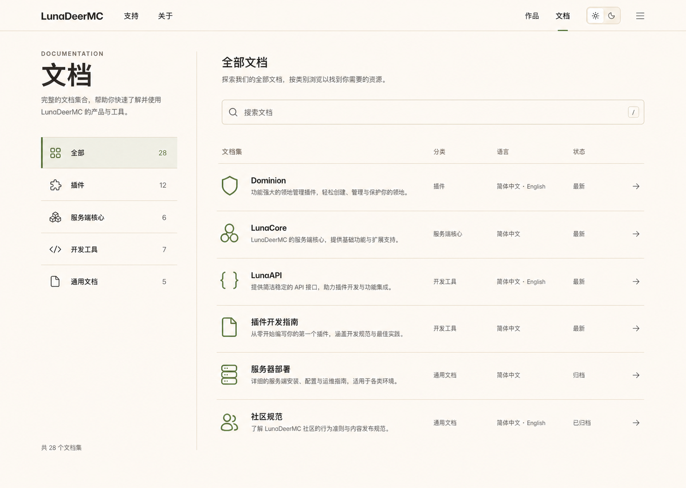

# 文档目录页

> 本文档固化 `/docs` 文档集目录页的已确认视觉结构。它只定义文档集入口，不替代文档阅读布局、侧边栏或搜索系统专题。

- 最后更新：2026-07-30
- 状态：桌面端核心结构已确认；移动端重排与精确尺寸待正式实现校准

## 权威视觉参考



该图是文档目录页桌面端核心结构的权威参考。图中具体文档名称、数量、语言状态和说明属于视觉稿示例，不是正式内容数据。

## 页面职责

`/docs` 是文档集目录，不是文档阅读页。它帮助用户：

1. 浏览全部文档集，或按文档分类收窄范围。
2. 在当前范围内搜索文档。
3. 根据名称、说明、分类、语言和状态选择正确的文档集入口。

页面不展示某个文档集内部的章节树、上一篇／下一篇或页内目录。

## 已确认布局

桌面端使用左右主从结构：

```text
全站导航
└── 文档目录主体
    ├── 左侧身份与分类
    │   ├── DOCUMENTATION / 文档
    │   ├── 简短说明
    │   └── 全部、插件、服务端核心、开发工具、通用文档
    └── 右侧当前范围
        ├── 范围标题与说明
        ├── 文档搜索
        └── 表格化文档集列表
```

- 左侧保持稳定，不放置搜索框。
- 分类首项固定为“全部”，其后依次为插件、服务端核心、开发工具和通用文档。
- 分类项可以显示当前语言下公开文档集数量。
- 右侧顶部先说明当前范围，再显示搜索框。
- 搜索只改变右侧结果，不改变左侧分类结构。

## 文档集列表

右侧采用开放的表格化列表，不使用卡片墙。桌面端信息列为：

```text
文档集 | 分类 | 语言 | 状态 | 进入
```

- “文档集”列包含图标、名称和一行说明，是最主要的信息列。
- “分类”帮助用户在“全部”范围中理解归属；进入具体分类后仍可保留，以维持列结构稳定。
- “语言”只显示当前文档集真实存在的语言，不暗示缺失翻译。
- “状态”以克制文字表达公开或归档状态，不使用高饱和徽章。
- 行尾使用统一的 Lucide 箭头表达进入文档集。
- 普通行通过留白和细分隔线建立层级，不增加独立背景、阴影或大圆角。

## 图标与内容边界

- 界面操作和通用文档语义继续使用 Lucide 线性图标。
- 与作品关联的文档集可以使用作品自身的登记图标。
- 不使用 Minecraft 方块、体素或像素风功能图标。
- 视觉稿中的文档集、数量和状态均为示例；正式页面从文档内容模型生成。

## 主题与视觉语言

- 浅色模式继承“白天牧场”的燕麦画布、深森林文字和牧草绿强调。
- 深色模式继承“黄昏红石工坊”的暖炭褐画布、暖色文字和红石珊瑚强调。
- 两个主题保持完全相同的信息顺序、列结构和交互含义。
- 页面沿用全站“开放几何”：优先使用网格、排版、留白和分隔线，不增加第三套表面语言。

## 响应式原则

正式实现时按以下顺序收敛：

1. 右侧次要列先缩短文字或降低占用，但不压缩文档集名称与说明到不可读。
2. 左侧分类在窄屏转为页面顶部的分类工具栏或抽屉。
3. 移动端列表改为纵向信息组，保留名称、说明、分类、语言和必要状态。
4. 搜索始终位于结果列表之前，不移回分类区域。

## 与其他专题的关系

- 文档集范围与内容来源由[文档内容模型](../technical-architecture/document-content-model.md)定义。
- 搜索范围、结果和键盘交互由[全站搜索体验](./search-experience.md)定义。
- 颜色、排版、图标和表面分别由对应全站设计专题定义。
